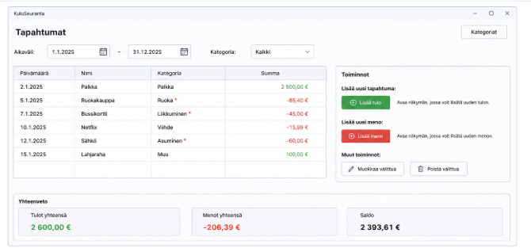
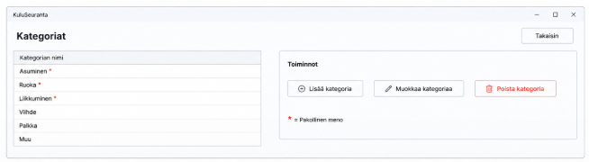

# Käyttöliittymän suunnitelma

## Näkymä 1

**Olennaiset toiminnot**

- Tämä on sovelluksen aloitusnäkymä.
- Käyttäjä näkee kaikki tulot ja menot eli tapahtumat taulukossa
- Taulukossa on ainakin tapahtuman
  - nimi
  - summa
  - päivämäärä
  - kategoria
- Käyttäjä voi lisätä uuden tapahtuman syöttämällä nimen,
summan, päivämäärän ja kategorian.
- Positiivinen summa = tulo, negatiivinen = meno
- Käyttäjä voi muokata valittua tapahtumaa.
- Käyttäjä voi poistaa valitun tapahtuman.
- Käyttäjä voi suodattaa tapahtumia aikavälin perusteella valitsemalla alku- ja loppupäivämäärän.
- Käyttäjä voi suodattaa tapahtumia kategorian perusteella.
- Käyttäjä näkee yhteenvedon tuloista, menoista ja saldosta.
- Tästä näkymästä käyttäjä voi siirtyä kategorioiden hallintaan.

**Olennaiset komponentit**

- BorderPane tai VBox pääasetteluun
- TableView tapahtumien näyttämiseen
- TableColumn sarakkeille: nimi, summa, päivämäärä ja kategoria
- TextField tapahtuman nimen ja summan syöttämiseen
- DatePicker päivämäärän valitsemiseen
- ComboBox kategorian valitsemiseen
- Button tapahtuman lisäämiseen, muokkaamiseen ja poistamiseen
- DatePicker aikavälisuodatukseen
- ComboBox kategoriasuodatukseen
- Label tulojen, menojen ja saldon näyttämiseen

## Näkymä 2

**Olennaiset toiminnot**

- Käyttäjä pääsee tähän näkymään pääsivulta "Kategoriat"-painikkeella.
- Käyttäjä näkee kaikki olemassa olevat kategoriat listassa tai taulukossa.
- Käyttäjä voi lisätä uuden kategorian antamalla sille nimen.
- Käyttäjä voi määrittää, onko kategoria välttämätön meno.
- Käyttäjä voi muokata kategorian nimeä.
- Kun kategorian nimi vaihdetaan, kaikki kyseiseen kategoriaan liittyvät tapahtumat säilyvät samassa kategoriassa, koska tapahtumat viittaavat Kategoria-olioon.
- Käyttäjä voi poistaa kategorian.
- Kun kategoria poistetaan, sitä ei poisteta tapahtumista poistamalla tapahtumia, vaan kyseisten tapahtumien kategoriaksi asetetaan tyhjä arvo.
- Käyttäjä voi palata takaisin tapahtumien pääsivulle.

**Olennaiset komponentit**

- VBox tai BorderPane näkymän asetteluun
- TableView tai ListView kategorioiden näyttämiseen
- TableColumn kategorian nimelle
- TableColumn tiedolle siitä, onko kategoria välttämätön
- TextField kategorian nimen syöttämiseen
- CheckBox välttämättömän menon valitsemiseen
- Button kategorian lisäämiseen
- Button kategorian muokkaamiseen
- Button kategorian poistamiseen
- Button takaisin pääsivulle siirtymiseen